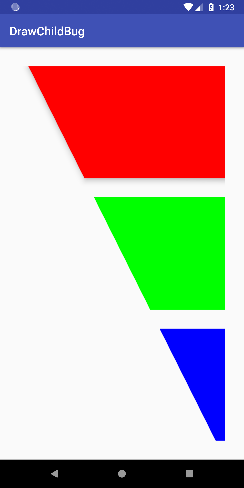
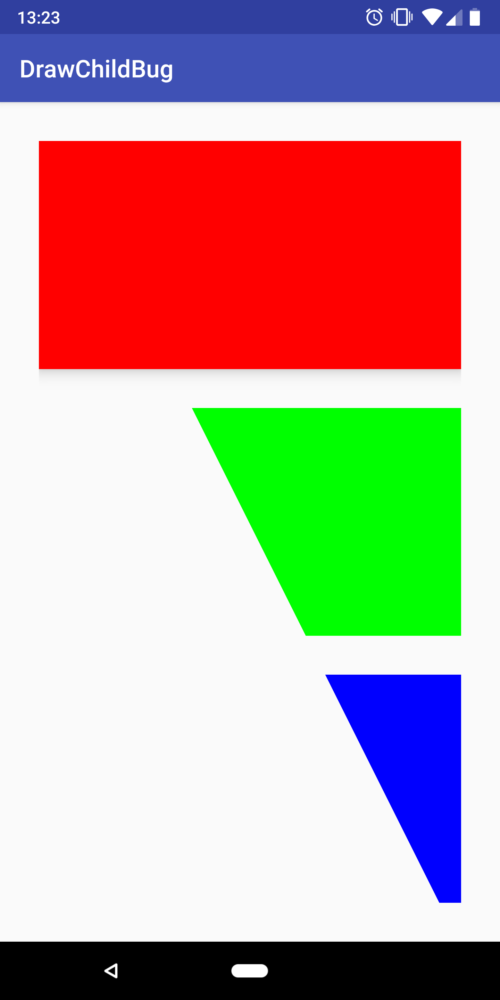

DrawChildBug
============

This project illustrates a bug with the Android P Preview on physical hardware.
The problem is not reproducible on an Emulator, but can be reproduced on a
Pixel 2 XL, OS build number `PPP2.180412.013`.

Canvas transformations in `ViewGroup.drawChild` have no effect if the child has
an elevation. To reproduce the issue, install the app on an emulator or device
running an API level below 27 and on a Pixel 2 XL running the P preview.

### Result on API < 27 (or 27 emulator)

### Result on API 27

### Relevant code

- [`SkewLayout`](app/src/main/java/damianw/github/com/drawchildbug/SkewLayout.kt)
- [`activity_main.xml`](app/src/main/res/layout/activity_main.xml)
